# Autoencoders

Pytorch implementation of autoencoders as a coursework in AI502 Deep Learning.

Aim to reproduce one or two experimental result(s) of the original papers.

## Dataset

Experiments are coducted based on MNIST, FreyFace, dSprites or CelebA datasets which is public for academical use.

- MNIST : http://yann.lecun.com/exdb/mnist/
- FreyFace : https://cs.nyu.edu/~roweis/data.html
- dSprites : https://github.com/deepmind/dsprites-dataset
- CelebA : https://mmlab.ie.cuhk.edu.hk/projects/CelebA.html

Please download the datasets and save into 'MODEL_DIRECTORY/data/' as a preparation.

## Models (in order of appearance)

- Denoising Autoencoder (ICML 2008)
  - Paper link : https://dl.acm.org/doi/pdf/10.1145/1390156.1390294
  - Main idea : corrupting certain portion of the input to obtain robust feature
  - [report](./DenoisingAE/DenoisingAE.pdf)
  - [reproduction](./DenoisingAE/DenoisingAE.ipynb)
  
  Filter plot by increasing corruption rate (0% -> 25% -> 50%)
  
  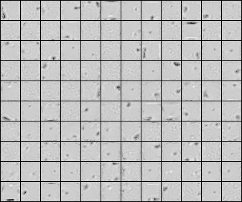
  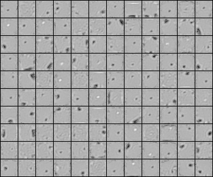
  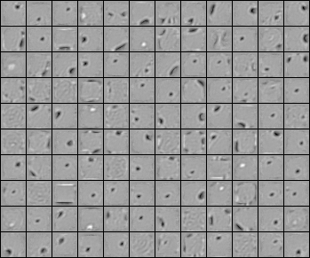
  
- K-sparse Autoencoder (ICLR 2014)
  - Paper link : https://arxiv.org/pdf/1312.5663.pdf
  - Main idea : exploiting only K largest activations as a way of sparse coding
  - [report](./KsparseAE/KsparseAE.pdf)
  - [reproduction](./KsparseAE/KsparseAE.ipynb)

  Filter plot by increasing corruption rate (10% -> 25% -> 40% -> 70%)

  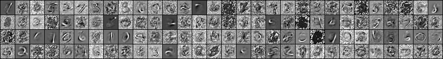
  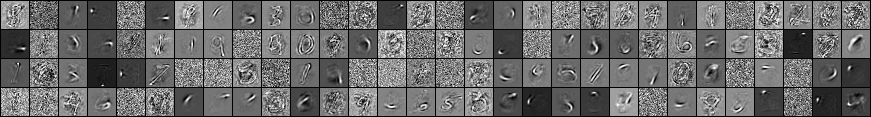
  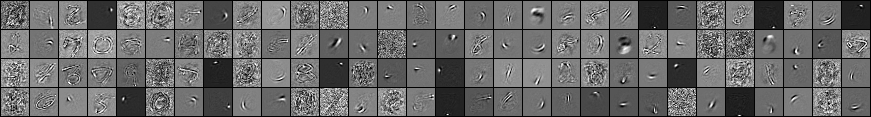
  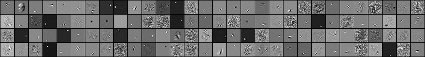
 
- Variational Autoencoder (ICLR 2014)
  - Paper link : https://arxiv.org/pdf/1312.6114.pdf
  - Main idea : inferring the latent variable in generative process by autoencoder
  - [report](./VariationalAE/VariationalAE.pdf)
  - [reproduction](./VariationalAE/VariationalAE.ipynb)  

  Latent space of MNIST and FreyFace datasets.
  By traversing each axis, the images changes in monotonical manner.

  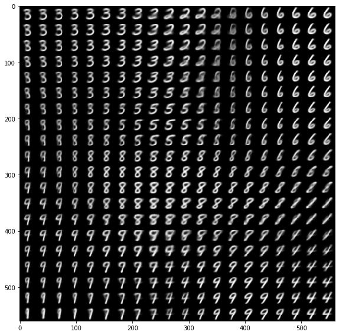
  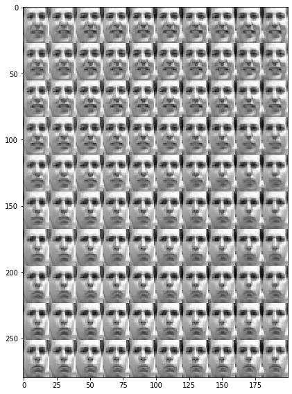

- Stick-Breaking Variational Autoencoder (ICLR 2017)
  - Paper link : https://arxiv.org/pdf/1605.06197.pdf
  - Main idea : allowing possibly infinite size of latent variable with dirichlet process
  - report (to be filled)
  - [reproduction](./SB_VAE/SB_VAE.ipynb)  

- Beta Variational Autoencoer (ICLR 2017)
  - Paper link : https://openreview.net/pdf?id=Sy2fzU9gl
  - Main idea : constraining the value of the regularization term for interpretability
  - [report](./BetaVAE/BetaVAE.pdf)
  - [reproduction-dSprites](./BetaVAE/BetaVAE(shapes).ipynb), [reproduction-CelebA](./BetaVAE/BetaVAE(celeba).ipynb)

  Latent traverse of CelebA dataset. (Left) direction, (Right) hair color
  
  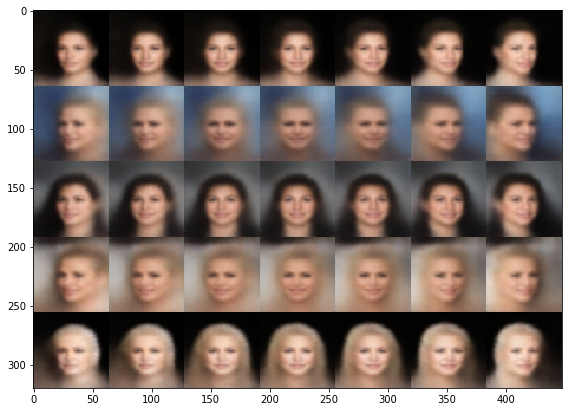
  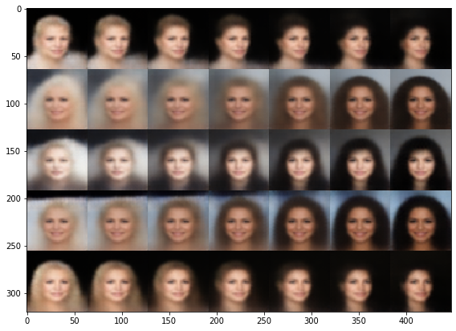
  
  
  
